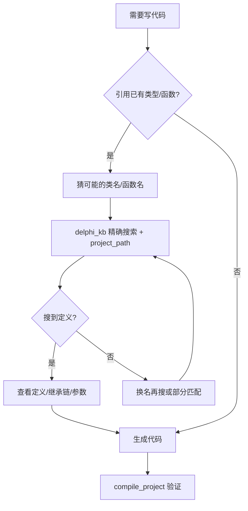

# AGENTS.md - Agent Coding Guidelines

This file provides guidelines for agentic coding agents operating in this repository.

## Project Overview

This is a **Delphi MCP Server** - a Model Context Protocol server that provides Delphi project compilation capabilities and knowledge base querying for AI assistants (Claude Desktop, CodeArts Agent, etc.).

- **Language**: Python 3.10-3.14
- **Platform**: Windows
- **Test Framework**: pytest (with pytest-asyncio for async tests)
- **Key Dependencies**: mcp>=0.9.0, pydantic>=2.0.0, beautifulsoup4, lxml, requests
- **Optional Dependencies**: PyMuPDF (recommended for PDF), pdfplumber (fallback for PDF), python-docx

## Project Structure

```
delphi-complier-mcp-server/
├── src/                      # Main source code
│   ├── server.py             # MCP Server entry point
│   ├── tools/               # MCP tool implementations
│   ├── services/            # Business logic services
│   ├── models/              # Data models (Pydantic/dataclasses)
│   └── utils/               # Utility functions
├── tests/                   # Test files
├── config/                  # Configuration files
├── data/                    # Knowledge base data
├── docs/                    # Documentation
└── pyproject.toml          # Project configuration
```

---

## Build, Lint, and Test Commands

### Environment Setup

```bash
# Create and activate virtual environment (Windows)
python -m venv venv
venv\Scripts\activate

# Install dependencies
pip install -r requirements.txt
pip install -e ".[dev]"  # Includes pytest, pytest-asyncio, pytest-cov

# Install optional PDF processing libraries
pip install PyMuPDF  # Recommended for PDF processing (better performance)
# OR
pip install pdfplumber  # Alternative for PDF processing (pure Python)
```

### Windows Encoding Settings

**IMPORTANT**: On Windows, always set UTF-8 encoding:

```bash
# Option 1: Per command
PYTHONIOENCODING=utf-8 python your_script.py

# Option 2: For session
set PYTHONIOENCODING=utf-8
python your_script.py
```

### Development Setup

```bash
# Install all dependencies (including dev)
pip install -e ".[dev]"

# Install in development mode with editable source
pip install -e .
```

### Testing Commands

```bash
# Run all tests
pytest

# Run specific test file
pytest tests/test_knowledge_base.py

# Run tests with verbose output
pytest -v

# Run a single test by name
pytest tests/test_knowledge_base.py::test_search_by_class_name -v

# Run tests with coverage report
pytest --cov=src --cov-report=html

# Run tests and generate XML coverage report for CI
pytest --cov=src --cov-report=xml

# Run tests with specific markers (if any are defined)
pytest -m "not slow"

# Run tests and stop after first failure
pytest -x
```

### Code Quality & Linting

```bash
# Type checking with mypy (if configured)
mypy src/

# Format code with black (if installed)
black src/ tests/

# Sort imports with isort (if installed)
isort src/ tests/

# Lint with flake8 (if installed)
flake8 src/ tests/
```

### Running the Server

```bash
# Run the MCP server
python src/server.py

# Run with specific configuration
python src/server.py --config config/config.json
```

### Building Knowledge Bases

知识库构建已整合到 MCP 工具中，通过 `delphi_kb` 工具调用：

```bash
# Build project knowledge base (project_path 可选——不传时自动从 CWD 检测 .dproj)
# delphi_kb(action="build", kb_type="project", project_path="path/to/project.dproj")

# Build Delphi help document knowledge base (async)
# delphi_kb(action="build", kb_type="document", directory="C:\Program Files (x86)\Embarcadero\Studio\22.0\Help\Doc", extensions=[".chm"], async_mode=true)

# Build Delphi official source knowledge base
# delphi_kb(action="build", kb_type="delphi", version="22.0", async_mode=true)

# Build third-party library knowledge base
# delphi_kb(action="build", kb_type="thirdparty", version="22.0", async_mode=true)
```

---

## Delphi Knowledge Base Quick Reference

### Entity Types (Two-Letter Codes)

| Code | Type | Description |
|------|------|-------------|
| **TC** | Type/Class | class |
| **TR** | Type/Record | record |
| **TI** | Type/Interface | interface |
| **TE** | Type/Enum | enum |
| **TS** | Type/Set | set of |
| **TY** | Type | type alias |
| **FF** | Function | function |
| **FP** | Procedure | procedure |
| **CC** | Constant | const |
| **CR** | Constant | resourcestring |

### Search Functions

- Use `search_by_name()` for generic searches (covers all types)
- Use `search_by_class_name()` specifically for class types (TC)
- Prefer generic naming over single-letter codes for clarity

### Knowledge Base Types (via `delphi_kb` tool)

| kb_type | Description | Build Command |
|---------|------------|---------------|
| `delphi` | Delphi 官方源码 (RTL/VCL/FMX 等) | `action=build, version=<ver>` |
| `project` | 项目级知识库 (项目源码 + 三方库) | `action=build` (project_path 可选，不传时自动检测) |
| `thirdparty` | 全局共享第三方库知识库 | `action=build, version=<ver>` |
| `document` | 通用文档 (txt/md/html/docx/pdf/epub/hlp/chm/网页) | `action=build` + `directory`/`url`/`urls` |

### Source Scanner File Extensions

The `DelphiSourceScanner` scans these extensions:
- `.pas`, `.dpr`, `.dpk`, `.dfm`, `.inc`

### Incremental Build Notes

- **mtime_size mode** (default): Fast change detection using file modification time + size
- **md5 mode**: Accurate but slower, computes file hash for every file
- **Project KB**: Shares third-party paths with global KB to avoid redundant scanning
- **Help KB**: Supports incremental update (skip unchanged files by mtime)

---

## Code Style Guidelines

### General Principles

- Use **type hints** for all function parameters and return types
- Use **Pydantic models** or **dataclasses** for data structures
- Use **async/await** for I/O operations
- Follow **PEP 8** conventions (max line length: 100 chars)
- Use **f-strings** for string formatting (not `%` or `.format()`)

### Imports Order & Grouping

Group imports in this order:
1. Standard library imports
2. Third-party imports  
3. Local application imports

Separate each group with a blank line. Sort imports alphabetically within each group.

```python
# Standard library
import os
import re
import sqlite3
from pathlib import Path
from typing import Dict, List, Optional

# Third-party
import pydantic
from mcp import Client, Server

# Local application
from src.models.delphi_entities import Entity
from src.utils.file_utils import read_file
```

### Naming Conventions

| Type | Convention | Example |
|------|------------|---------|
| Modules | snake_case | `scan_delphi_sources.py` |
| Classes | PascalCase | `DelphiSourceScanner` |
| Functions | snake_case | `_analyze_file_worker()` |
| Variables | snake_case | `source_files` |
| Constants | UPPER_SNAKE | `KIND_CLASS = 'TC'` |
| Private functions | `_prefix` | `_parse_entity()` |
| Test functions | `test_` prefix | `test_search_by_class_name()` |
| Test classes | `Test` prefix | `TestKnowledgeBase` |

### Type Annotations

Always use type hints for function signatures and class attributes:

```python
def process_file(file_path: Path, encoding: str = "utf-8") -> Optional[List[Entity]]:
    """Process a single Delphi source file."""
    
    # Function with docstring and explicit return type
    pass

class DelphiScanner:
    def __init__(self, source_dir: Path, max_workers: int = 4) -> None:
        self.source_dir = source_dir
        self.max_workers = max_workers
        self.files_processed: List[Path] = []
```

### Error Handling

- Use specific exception types, not generic `Exception`
- Include descriptive error messages with context
- Use `try/except` blocks only when you can handle the exception

### Documentation

- Use docstrings for all public functions and classes
- Follow Google-style docstring format
- Include parameter types, return types, and example usage

### Testing Conventions

- Test file names: `test_*.py`
- Test class names: `Test*`
- Test method names: `test_*`
- Use `pytest` fixtures for setup/teardown
- Mock external dependencies using `unittest.mock`

## Agent 编码工作流

### 编译 Delphi 代码前的规则获取

AI Agent 在编译或生成 Delphi 代码前，**必须**先调用 `get_coding_rules` 获取编码规则：

```
步骤:
1. 调用 get_coding_rules(project_path="<项目.dproj路径>")
2. 工具返回 默认规则 + 用户自定义规则的合并内容（用户规则覆盖默认）
3. 严格按返回的规则编写/修改代码
4. 编译项目验证
```

规则包含：命名规则、格式化规则、类型声明顺序、文件头注释、修改代码约束、审核要点等。

### 构建 Delphi 帮助文档知识库

用户首次使用或需要重建 Delphi API 文档时，调用 `delphi_kb` 工具构建文档知识库：

```
delphi_kb(
    action="build",
    kb_type="document",
    async_mode=true
)
```

说明：
- **不传 directory 时自动检测**最新安装的 Delphi 帮助目录（通过注册表或默认路径）
- 也可手动指定：`directory="C:\Program Files (x86)\Embarcadero\Studio\<版本>\Help\Doc"`
  - 版本对照：37.0=Delphi 13, 23.0=Delphi 12, 22.0=Delphi 11, 21.0=Delphi 10.4, 20.0=Delphi 10.3
- `extensions=[".chm"]`：只扫描 CHM 文件，工具会自动解压并导入 HTML 文档
- `async_mode=true`：异步执行（耗时数分钟），提交后返回 task_id，通过 `async_task(action=status, task_id=...)` 轮询进度
- 需要系统安装 7-Zip（可放在 `tools/7z/` 目录下免安装）

### 知识库使用策略

#### 项目路径上下文管理

**关键原则**：AI Agent 应从对话上下文中记住项目路径，而非依赖代码自动检测。

```
场景：用户在对话中提到项目路径
  "项目知识库路径：C:\User\diandaxia"
  "编译 C:\User\diandaxia\diandaxia.dproj"
  "搜索项目中的 TfrmMain"

AI Agent 应记住：
  PROJECT_PATH = "C:\User\diandaxia\diandaxia.dproj"

后续所有 delphi_kb(kb_type="project") 调用：
  ✅ delphi_kb(query="TfrmMain", kb_type="project", project_path="C:\User\diandaxia\diandaxia.dproj")
  ❌ delphi_kb(query="TfrmMain", kb_type="project")  ← 缺少 project_path，会报错
```

**何时需要传 project_path**：
- `kb_type="project"` 时**必须传入**
- `kb_type="all"` 时**可选**（不传则只搜 delphi + thirdparty）
- `kb_type="delphi"` 或 `"thirdparty"` 或 `"document"` 时**不需要传**

**记住项目路径的时机**：
1. 用户显式说明："项目在 D:\MyProject"、"编译 xxx.dproj"
2. 从之前的构建/编译操作中获知
3. 当前工作目录包含 .dproj 文件（可调用 glob 检测）

#### 核心原则：先猜精确名，再模糊搜

知识库的精确搜索（`search_by_name`）远强于语义搜索。AI Agent **应该利用自身对 Delphi 命名习惯的理解，将自然语言需求转换为可能的类名/函数名**，再进行精确搜索。

```
用户需求
    ↓
Agent 思考：这个功能在 Delphi 中可能的命名
  ┌─ TFormMain / TMainForm / TfrmMain
  ├─ OnButtonClick / DoClick / Button1Click
  ├─ SaveToFile / DoSave / WriteFile
  └─ ...
    ↓
delphi_kb(query="TFormMain", kb_type="project", project_path="...")    ← 精确搜索（最快最准）
delphi_kb(query="TMainForm", kb_type="project", project_path="...")     ← 换名字再试
    ↓
如果所有精确名都搜不到 → 才考虑语义搜索
```

> **注意**: `search_type="function"` 同时匹配函数(FF)和过程(FP)。如需只看过程用 `search_type="procedure"`。
> 搜索单元名（如 `System.DateUtils`）会自动回退到文件路径匹配，返回该文件的所有实体。

#### 搜索优先级

| 优先级 | 搜索方式 | 示例 | 适用场景 |
|--------|----------|------|----------|
| ⭐1 | 猜精确类名 → `search_by_name` | `TStringList` | 已知或能猜出类名 |
| ⭐2 | 猜函数名 → `search_type="function"` | `Create`、`DoSave` | 需要函数签名 |
| ⭐3 | 多关键字尝试 | `TJSONObject`、`TJsonSerializer` | 不确定确切命名 |
| ⭐4 | `search_type="reference"` | `form.main` | 查引用/调用方 |
| ⭐5 | `search_type="semantic"` | 中文需求 | 以上都搜不到时（需先 build_embedding）|

#### 典型场景与搜索策略

**场景 A：需要调用某个 API**
```
❌ 错误做法：
   delphi_kb(query="帮我找找字符串分割的函数", search_type="semantic")

✅ 正确做法：
   1. 思考：字符串分割在 Delphi 中通常叫 Split、TStringList.Delimiter、ExtractString
   2. delphi_kb(query="Split", kb_type="delphi", search_type="function")
   3. delphi_kb(query="TStringList", kb_type="delphi", search_type="class")
```

**场景 B：需要写代码引用项目中的类**
```
✅ 正确做法：
   1. delphi_kb(query="TfrmMain", kb_type="project", project_path="...")
   2. 查看定义行号和文件
   3. 了解继承链（TForm → TfrmMain）和公开属性后再写代码
```

**场景 C：修改代码前评估影响**
```
✅ 正确做法：
   1. delphi_kb(query="form.main", kb_type="project", search_type="reference", project_path="...")
   2. 查看所有引用该单元的文件（88 个引用）
   3. 评估修改影响范围
```

#### 编码前查定义的工作流

AI Agent 在写任何涉及 Delphi 类型/函数的代码前，应按以下流程操作：



#### 知识库范围选择

| 搜索目标 | 推荐的 kb_type | 说明 |
|----------|---------------|------|
| 项目自有代码 | `project` | 当前项目源码，最优先 |
| VCL/FMX/RTL API | `delphi` | Delphi 官方源码 |
| 三方组件 | `thirdparty` | 共享三方库知识库 |
| 全部 | `all`（默认） | 同时搜三个库，结果最多

### Knowledge Base Schema (Current)

All knowledge bases (Delphi/project/thirdparty) use the **same unified schema** via `SmartCacheKnowledgeBase`:

```
files 表（统一文件索引）
├── id              INTEGER PRIMARY KEY
├── full_path       TEXT UNIQUE           ← 去重键
├── relative_path   TEXT
├── extension       TEXT
├── size/line_count/hash/last_modified
├── units_defined   TEXT                  ← 该文件定义的所有单元名（逗号分隔）
├── units_imported  TEXT                  ← 该文件 uses 的所有单元名（逗号分隔）
└── ...

vocabularies 表（统一实体索引——替代废弃的 classes/functions 分表）
├── id              INTEGER PRIMARY KEY
├── type            TEXT NOT NULL         ← 两字母 kind code: TC/TR/TI/TE/TS/TY/FF/FP/CC/CR
├── name            TEXT NOT NULL
├── name_lower      TEXT NOT NULL
├── name_lower_rev  TEXT                  ← 反转字符串，用于反转索引（前缀搜索加速）
├── file_id         INTEGER              ← FK → files(id)
├── line            INTEGER
├── base_class      TEXT                  ← 仅类型（class/record/interface）有
├── description     TEXT
├── vector          BLOB                 ← 稀疏向量（TF-IDF），按需构建
├── vector_status   TEXT DEFAULT 'pending'
└── ...

vocabulary 表（已废弃——原 TF-IDF 词表，已被 SQLite FTS5 替代。保留以兼容旧库读取）
├── id              INTEGER PRIMARY KEY
├── word            TEXT UNIQUE
├── idf_weight      REAL
└── ...
【v2026.05.12 起从建表代码中移除，旧库升级时自动清理此表】

metadata 表（key-value 格式）
├── key             TEXT PRIMARY KEY
├── value           TEXT
└── ...
```

**注意**：
- `vocabularies`（复数）= 实体表，存所有类/函数/常量等；`vocabulary`（单数）= 词表，存 TF-IDF 词频
- 所有类型统一存储在 `vocabularies` 表，不再拆分 `classes`/`functions`/`constants` 等分表
- `SQLiteVectorKnowledgeBase._create_tables()` 中的 `classes`/`functions` 表是**废弃 schema**，`SQLiteVectorKnowledgeBase` 只用于查询已建好的库，不负责建表
- 建表由 `SmartCacheKnowledgeBase._create_tables()` 或 `ProjectKnowledgeBase._create_*_tables()` 完成

### Kind Constants

Use two-letter codes defined in `scan_delphi_sources.py`, stored in `vocabularies.type`:

```python
KIND_CLASS = 'TC'      # class
KIND_RECORD = 'TR'     # record
KIND_INTERFACE = 'TI'  # interface
KIND_ENUM = 'TE'       # enum
KIND_SET = 'TS'        # set of
KIND_TYPE = 'TY'       # type alias
KIND_HELPER = 'TH'     # class/record helper
KIND_FUNC = 'FF'       # function
KIND_PROC = 'FP'       # procedure
KIND_CONST = 'CC'      # const
KIND_RESOURCE = 'CR'   # resourcestring
```

---

## Agent 自身操作规范

### 1. 避免 `python -c` 内联脚本——始终写文件

**典型场景**：用 `bash` 工具执行 `python -c "..."` 测试逻辑。

**问题**：
- PowerShell 对引号的处理与 cmd/Linux 完全不同。双引号内的 `$`、`\`、`"` 等字符会被 PowerShell 拦截
- Python f-string 中的 `{x["key"]}` 含有双引号，在 PowerShell 中极难正确转义
- 嵌套引号（`'` 内套 `"` 内套 `'`）几乎必然出错

**案例**：本次调试中数十次 `SyntaxError: unterminated string literal`，全部来自 `python -c "..."` 方式。

**原则**：
- ✅ **始终用 `write` 工具创建 `.py` 文件，然后用 `bash` 执行 `python script.py`**
- ❌ 绝不用 `python -c "..."` 或 `python -c '...'` 内联方式
- 脚本用完后用 `Remove-Item script.py` 清理

### 2. 字符串模板用 `.format()` 而非 f-string 混合引号

**典型场景**：f-string 内嵌字典访问 `f'{d["key"]}'`。

**问题**：f-string 内的引号与外部引号冲突，尤其在 SQL 语句中。

**原则**：
- 含字典/列表访问的字符串用 `.format()` 或 `%` 格式化
- SQL 查询中的表名列名用变量替代，值用参数化查询
- f-string 只用于简单变量拼接：`f"文件: {name}"`

### 3. 测试时避免内联，使用独立脚本

**典型场景**：验证某个函数行为时，用 `python -c "import ...; print(...)"`。

**原则**：
- ✅ 写独立脚本 → 执行 → 清理
- 脚本文件名前缀 `test_` 便于识别
- 复杂测试直接放到 `tests/` 目录下

以下是从实战调试中总结的经验，帮助 AI Agent（包括你自己）在排查问题时减少试错。

### 1. 表结构变更 → 全面清理残留引用

**典型场景**：删除一个表或列后，代码中仍有 DELETE/INSERT/SELECT 引用。

**案例**：`vocabulary`（单数）表从 `_create_tables()` 移除后，`_rebuild_init` 中尚有 `DELETE FROM vocabulary`，`_build_vocabulary_table` 中尚有 `INSERT INTO vocabulary`，`get_statistics` 中尚有 `SELECT COUNT(*) FROM vocabulary`。三处全部漏删，运行时崩溃。

**原则**：
- 修改 `_create_tables` 后，必须 `grep` 全项目搜索旧表名/列名的**所有引用**（INSERT/DELETE/SELECT/ALTER）
- 不只是 DDL 语句，所有的 DML 语句也要查
- 测试要覆盖「全新 DB 创建」和「旧 DB 升级」两个路径

### 2. Python 局部变量作用域陷阱：`from X import Y` 放在循环内

**典型场景**：在函数内部的 `for`/`if` 块中局部 import。

**案例**：
```python
# BUG: Path 在循环内被 import，Python 视其为整个函数局部变量
def build_thirdparty_knowledge_base(self, ...):
    for path in thirdparty_paths:
        try:
            source_dir = Path(path)   # ❌ UnboundLocalError: 局部 Path 尚未赋值
            ...
        except Exception as e:
            pass
    ...
    for file_info in all_files:
        ...
        if not unit_names:
            from pathlib import Path   # ← 这个局部 import 导致上面的 Path 调用失败
            unit_names = [Path(file_info.get('path', '')).stem]
```

**原则**：
- Python 中**同一函数内任何地方**出现 `from X import Y`，都会使 `Y` 在整个函数范围内成为局部变量
- 如果该 `import` 在函数尾部的一个分支里，函数头部引用 `Y` 时会 `UnboundLocalError`
- ✅ 始终将 `import` 放在文件顶部，不要在函数内局部 import（除非有充分理由）
- 如果必须局部 import，也要放在函数最前面，不可放在分支内部

### 3. 多处冗余 DDL → 统一为共享 schema 模块

**典型场景**：3+ 个地方各自 `CREATE TABLE`，列定义、约束、默认值不完全一致。

**案例**：SmartCache、ProjectKB（2 处）、ThirdPartyKB 各自有 `CREATE TABLE files (...)`，有些用 `full_path TEXT`（无约束），有些用 `full_path TEXT UNIQUE NOT NULL`，有些列有 `DEFAULT` 有些没有。

**原则**：
- 所有建表语句集中到 `schema.py`，各 builder 调用 `create_source_tables()` / `create_document_tables()`
- `CREATE TABLE IF NOT EXISTS` 虽然不会重复建表，但**不保证列约束一致**
- grep 全项目 `CREATE TABLE` 确认没有漏网之鱼
- 索引（`CREATE INDEX`）也统一管理，不要散落在各处

### 4. 跨类方法访问：确认方法属于哪个类

**典型场景**：A 类调用 B 类的 `@staticmethod`，代码审查时只看了方法名没看属于哪个类。

**案例**：`ChmProcessor._find_7zip()` 调用 `self._find_7zip_path()`，但 `_find_7zip_path` 是 `GenericDocumentScanner` 的静态方法，不属于 `ChmProcessor` → `AttributeError` → 所有 CHM 文件提取失败 → 160328 个文档消失。

**原则**：
- 调用 `self.some_method()` 时，确认该方法**在当前类或父类中确实存在**
- 对于大文件（2000+ 行），跨类引用很容易漏检
- 静态方法用 `ClassName.method()` 调用更清晰，避免 `self.method()` 歧义

### 5. WAL 模式 vs DELETE 模式冲突导致 locked

**典型场景**：多个组件打开同一 SQLite 文件，一个用 WAL 其他尝试切到 DELETE。

**案例**：SQLiteVectorKnowledgeBase 用 `PRAGMA journal_mode=WAL` 打开 DB → 创建 `.shm` 文件。SmartCache 启动时执行 `PRAGMA journal_mode=DELETE` → 需要 checkpoint WAL → 要求独占锁 → 被 SQLiteVectorKnowledgeBase 占用 → `database is locked`。

**原则**：
- 同一 DB 文件的所有连接应使用**相同的 journal 模式**
- 切换 `journal_mode` 需要独占锁，运行中有其他连接时必然失败
- 本项目统一使用 WAL 模式即可：写入性能好，读不阻塞写

### 6. Python `if dur:` 与 `if dur is not None:` 的区别

**典型场景**：用 `if x:` 判断是否有值，但 `x=0` 是合法值。

**案例**：文档 KB 强制重建无变更时 `last_build_duration = 0`，展示代码用 `if dur:` 判断，0 被当作 False → 用时未显示。

**原则**：
- `if x:` 对 `0`、`0.0`、`""`、`[]`、`None` 都是 False
- 如果 0 是合法值，用 `if x is not None:` 判断
- 数字类型的可选参数使用 `Optional[int]` 类型标注提醒自己

### 7. 构建元数据：末次构建时间 + 用时统一记录

**典型场景**：构建完成后不知道上一次构建时间、耗时。

**修复**：
- 所有 KB 的 metadata 表记录 `last_build_time` 和 `last_build_duration`
- 构建开始时记录 `rebuilding=1`，结束时清除
- 强制重建时先 truncate 后 INSERT（不要逐行 DELETE + INSERT）

### 8. MCP 长轮询超时问题

**典型场景**：`long_poll_seconds=120` 结果返回 `MCP error -32001`。

**原理**：MCP 协议本身的请求通道有约 60 秒超时限制。长轮询虽然内部能等 120 秒，但 MCP 传输层先断掉。

**原则**：
- 长轮询推荐值 ≤ 30 秒
- 超时后切换为短轮询（不带 `long_poll_seconds` 直接调 `status`）
- 工具描述中标注超时限制，误导推荐值（如原 `推荐 long_poll=120s` 需要修正）

### 9. 删除旧数据的方式：truncate vs 逐行 DELETE

**场景**：强制重建时需清空 16 万条数据。

| 方式 | 代码 | 操作次数 |
|------|------|---------|
| ❌ 逐行 | `DELETE FROM doc WHERE full_path=?` per file | 160328 |
| ✅ truncate | `DELETE FROM documents`（SQLite 自动优化） | 1 |

SQLite 的 `DELETE FROM table` 无 WHERE 子句时会自动做 truncate 优化（直接重置 B-Tree），不必用 `TRUNCATE TABLE` 语法。

### 10. 重构流程 checklist

当需要做类似的大规模重构时：

```
[ ] 1. 找到所有重复 DDL 统一为 schema 模块
[ ] 2. grep 旧表名/列名的所有 CRUD 引用
[ ] 3. 删除废弃方法后验证无外部调用
[ ] 4. 检查同一个函数内有局部 import 导致的作用域问题
[ ] 5. 同一 SQLite 文件的 journal 模式保持一致
[ ] 6. 0 值判定用 is not None 而非 if x:
[ ] 7. 构建结束时记录 metadata（时间+用时+状态）
[ ] 8. 强制重建用 truncate 而非逐行 DELETE
[ ] 9. 全量测试（pytest）+ 手动触发各 KB 构建验证
[ ] 10. MCP 工具的超时说明要准确
```


## 版本历史

### v2026.05.13 (2026-05-13)

- **三方库KB扫描扩展名修复**：`rglob('*.pas')` 改为全扩展名扫描(`.pas/.dpr/.dpk/.dfm/.inc`)，文件数从 700 增至 1782
- **项目KB增量构建**：`build_project_knowledge_base` 改为 hash 比对增量模式，未变更文件跳过扫描
- **项目KB扫描优化**：`rglob` x6 改为 `os.walk` + 目录裁剪，跳过 Thirdpart/Win32 等目录，扫描从 60s 降至 1s
- **文件级 hash 优化**：`calculate_file_hash` 从 MD5(全文件读取) 改为 mtime+size，`analyze_file` 从 3 次 stat() 减为 1 次
- **仓库级 hash 优化**：`_calculate_source_hash` 从 MD5 遍历改为 `文件数|总大小|最新mtime` 三元组签名，同时跳过三方库目录
- **去重+唯一索引**：vocabularies 表新增 `(type, name, file_id)` 唯一索引 + `INSERT OR IGNORE`，清除 79473 条重复记录，DB 从 754MB 降至 92MB
- **Schema 版本管理**：SCHEMA_VERSION=2，所有 KB 类型统一写入版本号，支持按版本执行 schema 迁移
- **变更检测 + 自动异步重建**：搜索项目 KB 时检测源码变更，自动提交异步重建任务(防重入)，AI 可通过 task_id 轮询进度
- **多任务防重入**：`AsyncTaskManager.submit_task` 新增 `dedup_key` 参数，同类型构建任务自动复用已有 task_id
- **进度回调**：三方库 KB 和项目 KB 构建全程报告进度回调，`async_task` 可实时查看百分比
