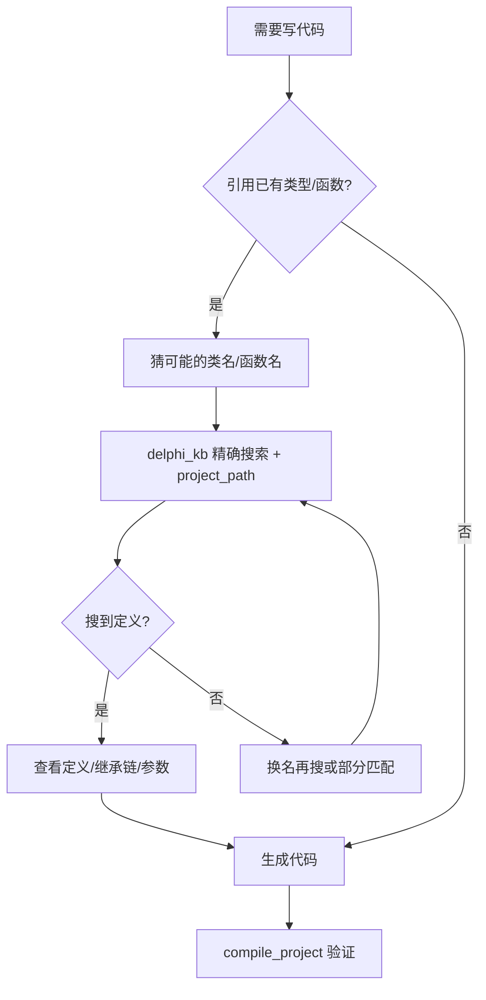

# AGENTS.md - Agent Coding Guidelines

This file provides guidelines for agentic coding agents operating in this repository.

## Project Overview

This is a **Delphi MCP Server** - a Model Context Protocol server that provides Delphi project compilation capabilities and knowledge base querying for AI assistants (Claude Desktop, CodeArts Agent, etc.).

- **Language**: Python 3.10-3.14
- **Platform**: Windows
- **Test Framework**: pytest (with pytest-asyncio for async tests)
- **Key Dependencies**: mcp>=0.9.0, pydantic>=2.0.0, beautifulsoup4, lxml, requests
- **Optional Dependencies**: PyMuPDF (recommended for PDF), pdfplumber (fallback for PDF), python-docx

## Project Structure

```
delphi-complier-mcp-server/
├── src/                      # Main source code
│   ├── server.py             # MCP Server entry point
│   ├── tools/               # MCP tool implementations
│   ├── services/            # Business logic services
│   ├── models/              # Data models (Pydantic/dataclasses)
│   └── utils/               # Utility functions
├── tests/                   # Test files
├── config/                  # Configuration files
├── data/                    # Knowledge base data
├── docs/                    # Documentation
└── pyproject.toml          # Project configuration
```

---

## Build, Lint, and Test Commands

### Environment Setup

```bash
# Create and activate virtual environment (Windows)
python -m venv venv
venv\Scripts\activate

# Install dependencies
pip install -r requirements.txt
pip install -e ".[dev]"  # Includes pytest, pytest-asyncio, pytest-cov

# Install optional PDF processing libraries
pip install PyMuPDF  # Recommended for PDF processing (better performance)
# OR
pip install pdfplumber  # Alternative for PDF processing (pure Python)
```

### Windows Encoding Settings

**IMPORTANT**: On Windows, always set UTF-8 encoding:

```bash
# Option 1: Per command
PYTHONIOENCODING=utf-8 python your_script.py

# Option 2: For session
set PYTHONIOENCODING=utf-8
python your_script.py
```

### Development Setup

```bash
# Install all dependencies (including dev)
pip install -e ".[dev]"

# Install in development mode with editable source
pip install -e .
```

### Testing Commands

```bash
# Run all tests
pytest

# Run specific test file
pytest tests/test_knowledge_base.py

# Run tests with verbose output
pytest -v

# Run a single test by name
pytest tests/test_knowledge_base.py::test_search_by_class_name -v

# Run tests with coverage report
pytest --cov=src --cov-report=html

# Run tests and generate XML coverage report for CI
pytest --cov=src --cov-report=xml

# Run tests with specific markers (if any are defined)
pytest -m "not slow"

# Run tests and stop after first failure
pytest -x
```

### Code Quality & Linting

```bash
# Type checking with mypy (if configured)
mypy src/

# Format code with black (if installed)
black src/ tests/

# Sort imports with isort (if installed)
isort src/ tests/

# Lint with flake8 (if installed)
flake8 src/ tests/
```

### Running the Server

```bash
# Run the MCP server
python src/server.py

# Run with specific configuration
python src/server.py --config config/config.json
```

### Building Knowledge Bases

知识库构建已整合到 MCP 工具中，通过 `delphi_kb` 工具调用：

```bash
# Build project knowledge base (project_path 可选——不传时自动从 CWD 检测 .dproj)
# delphi_kb(action="build", kb_type="project", project_path="path/to/project.dproj")

# Build Delphi help document knowledge base (async)
# delphi_kb(action="build", kb_type="document", directory="C:\Program Files (x86)\Embarcadero\Studio\22.0\Help\Doc", extensions=[".chm"], async_mode=true)

# Build Delphi official source knowledge base
# delphi_kb(action="build", kb_type="delphi", version="22.0", async_mode=true)

# Build third-party library knowledge base
# delphi_kb(action="build", kb_type="thirdparty", version="22.0", async_mode=true)
```

---

## Delphi Knowledge Base Quick Reference

### Entity Types (Two-Letter Codes)

| Code | Type | Description |
|------|------|-------------|
| **TC** | Type/Class | class |
| **TR** | Type/Record | record |
| **TI** | Type/Interface | interface |
| **TE** | Type/Enum | enum |
| **TS** | Type/Set | set of |
| **TY** | Type | type alias |
| **FF** | Function | function |
| **FP** | Procedure | procedure |
| **CC** | Constant | const |
| **CR** | Constant | resourcestring |

### Search Functions

- Use `search_by_name()` for generic searches (covers all types)
- Use `search_by_class_name()` specifically for class types (TC)
- Prefer generic naming over single-letter codes for clarity

### Knowledge Base Types (via `delphi_kb` tool)

| kb_type | Description | Build Command |
|---------|------------|---------------|
| `delphi` | Delphi 官方源码 (RTL/VCL/FMX 等) | `action=build, version=<ver>` |
| `project` | 项目级知识库 (项目源码 + 三方库) | `action=build` (project_path 可选，不传时自动检测) |
| `thirdparty` | 全局共享第三方库知识库 | `action=build, version=<ver>` |
| `document` | 通用文档 (txt/md/html/docx/pdf/epub/hlp/chm/网页) | `action=build` + `directory`/`url`/`urls` |

### Source Scanner File Extensions

The `DelphiSourceScanner` scans these extensions:
- `.pas`, `.dpr`, `.dpk`, `.dfm`, `.inc`

### Incremental Build Notes

- **mtime_size mode** (default): Fast change detection using file modification time + size
- **md5 mode**: Accurate but slower, computes file hash for every file
- **Project KB**: Shares third-party paths with global KB to avoid redundant scanning
- **Help KB**: Supports incremental update (skip unchanged files by mtime)

---

## Code Style Guidelines

### General Principles

- Use **type hints** for all function parameters and return types
- Use **Pydantic models** or **dataclasses** for data structures
- Use **async/await** for I/O operations
- Follow **PEP 8** conventions (max line length: 100 chars)
- Use **f-strings** for string formatting (not `%` or `.format()`)

### Imports Order & Grouping

Group imports in this order:
1. Standard library imports
2. Third-party imports  
3. Local application imports

Separate each group with a blank line. Sort imports alphabetically within each group.

```python
# Standard library
import os
import re
import sqlite3
from pathlib import Path
from typing import Dict, List, Optional

# Third-party
import pydantic
from mcp import Client, Server

# Local application
from src.models.delphi_entities import Entity
from src.utils.file_utils import read_file
```

### Naming Conventions

| Type | Convention | Example |
|------|------------|---------|
| Modules | snake_case | `scan_delphi_sources.py` |
| Classes | PascalCase | `DelphiSourceScanner` |
| Functions | snake_case | `_analyze_file_worker()` |
| Variables | snake_case | `source_files` |
| Constants | UPPER_SNAKE | `KIND_CLASS = 'TC'` |
| Private functions | `_prefix` | `_parse_entity()` |
| Test functions | `test_` prefix | `test_search_by_class_name()` |
| Test classes | `Test` prefix | `TestKnowledgeBase` |

### Type Annotations

Always use type hints for function signatures and class attributes:

```python
def process_file(file_path: Path, encoding: str = "utf-8") -> Optional[List[Entity]]:
    """Process a single Delphi source file."""
    
    # Function with docstring and explicit return type
    pass

class DelphiScanner:
    def __init__(self, source_dir: Path, max_workers: int = 4) -> None:
        self.source_dir = source_dir
        self.max_workers = max_workers
        self.files_processed: List[Path] = []
```

### Error Handling

- Use specific exception types, not generic `Exception`
- Include descriptive error messages with context
- Use `try/except` blocks only when you can handle the exception

### Documentation

- Use docstrings for all public functions and classes
- Follow Google-style docstring format
- Include parameter types, return types, and example usage

### Testing Conventions

- Test file names: `test_*.py`
- Test class names: `Test*`
- Test method names: `test_*`
- Use `pytest` fixtures for setup/teardown
- Mock external dependencies using `unittest.mock`

## Agent 编码工作流

### 编译 Delphi 代码前的规则获取

AI Agent 在编译或生成 Delphi 代码前，**必须**先调用 `get_coding_rules` 获取编码规则：

```
步骤:
1. 调用 get_coding_rules(project_path="<项目.dproj路径>")
2. 工具返回 默认规则 + 用户自定义规则的合并内容（用户规则覆盖默认）
3. 严格按返回的规则编写/修改代码
4. 编译项目验证
```

规则包含：命名规则、格式化规则、类型声明顺序、文件头注释、修改代码约束、审核要点等。

### 构建 Delphi 帮助文档知识库

用户首次使用或需要重建 Delphi API 文档时，调用 `delphi_kb` 工具构建文档知识库：

```
delphi_kb(
    action="build",
    kb_type="document",
    async_mode=true
)
```

说明：
- **不传 directory 时自动检测**最新安装的 Delphi 帮助目录（通过注册表或默认路径）
- 也可手动指定：`directory="C:\Program Files (x86)\Embarcadero\Studio\<版本>\Help\Doc"`
  - 版本对照：37.0=Delphi 13, 23.0=Delphi 12, 22.0=Delphi 11, 21.0=Delphi 10.4, 20.0=Delphi 10.3
- `extensions=[".chm"]`：只扫描 CHM 文件，工具会自动解压并导入 HTML 文档
- `async_mode=true`：异步执行（耗时数分钟），提交后返回 task_id，通过 `async_task(action=status, task_id=...)` 轮询进度
- 需要系统安装 7-Zip（可放在 `tools/7z/` 目录下免安装）

### 知识库使用策略

#### 项目路径上下文管理

**关键原则**：AI Agent 应从对话上下文中记住项目路径，而非依赖代码自动检测。

```
场景：用户在对话中提到项目路径
  "项目知识库路径：C:\User\diandaxia"
  "编译 C:\User\diandaxia\diandaxia.dproj"
  "搜索项目中的 TfrmMain"

AI Agent 应记住：
  PROJECT_PATH = "C:\User\diandaxia\diandaxia.dproj"

后续所有 delphi_kb(kb_type="project") 调用：
  ✅ delphi_kb(query="TfrmMain", kb_type="project", project_path="C:\User\diandaxia\diandaxia.dproj")
  ❌ delphi_kb(query="TfrmMain", kb_type="project")  ← 缺少 project_path，会报错
```

**何时需要传 project_path**：
- `kb_type="project"` 时**必须传入**
- `kb_type="all"` 时**可选**（不传则只搜 delphi + thirdparty）
- `kb_type="delphi"` 或 `"thirdparty"` 或 `"document"` 时**不需要传**

**记住项目路径的时机**：
1. 用户显式说明："项目在 D:\MyProject"、"编译 xxx.dproj"
2. 从之前的构建/编译操作中获知
3. 当前工作目录包含 .dproj 文件（可调用 glob 检测）

#### 核心原则：先猜精确名，再模糊搜

知识库的精确搜索（`search_by_name`）远强于语义搜索。AI Agent **应该利用自身对 Delphi 命名习惯的理解，将自然语言需求转换为可能的类名/函数名**，再进行精确搜索。

```
用户需求
    ↓
Agent 思考：这个功能在 Delphi 中可能的命名
  ┌─ TFormMain / TMainForm / TfrmMain
  ├─ OnButtonClick / DoClick / Button1Click
  ├─ SaveToFile / DoSave / WriteFile
  └─ ...
    ↓
delphi_kb(query="TFormMain", kb_type="project", project_path="...")    ← 精确搜索（最快最准）
delphi_kb(query="TMainForm", kb_type="project", project_path="...")     ← 换名字再试
    ↓
如果所有精确名都搜不到 → 才考虑语义搜索
```

> **注意**: `search_type="function"` 同时匹配函数(FF)和过程(FP)。如需只看过程用 `search_type="procedure"`。
> 搜索单元名（如 `System.DateUtils`）会自动回退到文件路径匹配，返回该文件的所有实体。

#### 搜索优先级

| 优先级 | 搜索方式 | 示例 | 适用场景 |
|--------|----------|------|----------|
| ⭐1 | 猜精确类名 → `search_by_name` | `TStringList` | 已知或能猜出类名 |
| ⭐2 | 猜函数名 → `search_type="function"` | `Create`、`DoSave` | 需要函数签名 |
| ⭐3 | 多关键字尝试 | `TJSONObject`、`TJsonSerializer` | 不确定确切命名 |
| ⭐4 | `search_type="reference"` | `form.main` | 查引用/调用方 |
| ⭐5 | `search_type="semantic"` | 中文需求 | 以上都搜不到时（需先 build_embedding）|

#### 典型场景与搜索策略

**场景 A：需要调用某个 API**
```
❌ 错误做法：
   delphi_kb(query="帮我找找字符串分割的函数", search_type="semantic")

✅ 正确做法：
   1. 思考：字符串分割在 Delphi 中通常叫 Split、TStringList.Delimiter、ExtractString
   2. delphi_kb(query="Split", kb_type="delphi", search_type="function")
   3. delphi_kb(query="TStringList", kb_type="delphi", search_type="class")
```

**场景 B：需要写代码引用项目中的类**
```
✅ 正确做法：
   1. delphi_kb(query="TfrmMain", kb_type="project", project_path="...")
   2. 查看定义行号和文件
   3. 了解继承链（TForm → TfrmMain）和公开属性后再写代码
```

**场景 C：修改代码前评估影响**
```
✅ 正确做法：
   1. delphi_kb(query="form.main", kb_type="project", search_type="reference", project_path="...")
   2. 查看所有引用该单元的文件（88 个引用）
   3. 评估修改影响范围
```

#### 编码前查定义的工作流

AI Agent 在写任何涉及 Delphi 类型/函数的代码前，应按以下流程操作：



#### 知识库范围选择

| 搜索目标 | 推荐的 kb_type | 说明 |
|----------|---------------|------|
| 项目自有代码 | `project` | 当前项目源码，最优先 |
| VCL/FMX/RTL API | `delphi` | Delphi 官方源码 |
| 三方组件 | `thirdparty` | 共享三方库知识库 |
| 全部 | `all`（默认） | 同时搜三个库，结果最多

### Kind Constants

Use two-letter codes defined in `scan_delphi_sources.py`:

```python
KIND_CLASS = 'TC'      # class
KIND_RECORD = 'TR'    # record
KIND_INTERFACE = 'TI' # interface
KIND_ENUM = 'TE'       # enum
KIND_SET = 'TS'        # set of
KIND_TYPE = 'TY'       # type alias
KIND_FUNC = 'FF'       # function
KIND_PROC = 'FP'      # procedure
KIND_CONST = 'CC'     # const
KIND_RESOURCE = 'CR'  # resourcestring
```


